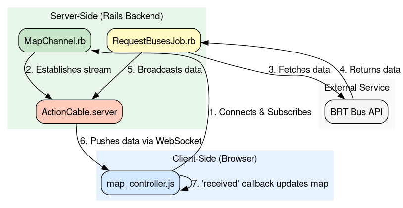

# Buses Monitor

A Ruby on Rails project to list all buses from Rio de Janeiro city in a full screen map in real time.

## Table of Contents

- [Purpose](#purpose)
- [Features](#features)
- [Technology Stack](#technology-stack)
- [Getting Started with Docker Compose](#getting-started-with-docker-compose)
- [Usage Example](#usage-example)
- [Development](#development)
- [License](#license)

## Purpose

The main goal of this project is to provide a real-time visualization of all buses operating in Rio de Janeiro. Users can view the current locations of buses on a full screen map, making it easier to monitor public transportation in the city.

## Features

- Real-time bus location updates on a map
- Full screen map interface for better visualization
- Simple and intuitive UI
- Built with Ruby on Rails for rapid development

## Websocket structure to update bus list inside the map


Explanation in text:
```
graph TD
	subgraph "Client-Side (Browser)"
		A["map_controller.js"]
	end

	subgraph "Server-Side (Rails Backend)"
		B["MapChannel.rb"]
		C["RequestBusesJob.rb"]
		D["ActionCable.server"]
	end

	subgraph "External Service"
		E["BRT Bus API"]
	end

	A -- "1. Connects & Subscribes to MapChannel" --> B;
	B -- "2. Establishes stream from 'map_controller_channel'" --> D;

	C -- "3. Performs background job, fetches data from" --> E;
	E -- "4. Returns bus data" --> C
	C -- "5. Broadcasts bus data to 'map_controller_channel'" --> D;

	D -- "6. Pushes data via WebSocket to subscribed clients" --> A;
	A -- "7. 'received' callback is triggered" --> A;
	A -- "8. Updates Leaflet map with new bus locations" --> A;

	style A fill:#D2E9FF,stroke:#333,stroke-width:2px
	style B fill:#C8E6C9,stroke:#333,stroke-width:2px
	style C fill:#FFF9C4,stroke:#333,stroke-width:2px
	style D fill:#FFCCBC,stroke:#333,stroke-width:2px
	style E fill:#F5F5F5,stroke:#333,stroke-width:1px
```

## Technology Stack

- [**Ruby on Rails**](https://rubyonrails.org/) - Web framework
- [**SQLite**](https://sqlite.org/) - Primary database
- **HTML5 & CSS3** - Front-end markup and styling
- [**Leaflet JS Maps API**](https://leafletjs.com/) - Map visualization
- [**Docker & Docker Compose**](https://www.docker.com/) - Containerization
- [**Puma**](https://puma.io/) - Application server

## Getting Started with Docker Compose

To run the project locally using Docker Compose:

1. Clone this repository:
	```sh
	git clone https://github.com/henriqueaf/buses_monitor.git
	cd buses_monitor
	```
2. Build and start the containers:
	```sh
	docker-compose up --build
	```
3. Access the application at [http://localhost:3000](http://localhost:3000)


## Usage Example

Once the application is running, open your browser and navigate to [http://localhost:3000](http://localhost:3000). You will see a full screen map displaying the real-time positions of all buses in Rio de Janeiro.


## Development

To develop or debug the application using Docker, use the following commands:

- **Start the Rails server:**
  ```sh
  docker-compose up --build
  ```

- **Open a Rails console inside the running container:**
  ```sh
  docker compose run --rm app bin/rails c
  ```

## License

This project is licensed under the MIT License. See the [LICENSE](LICENSE) file for details.
